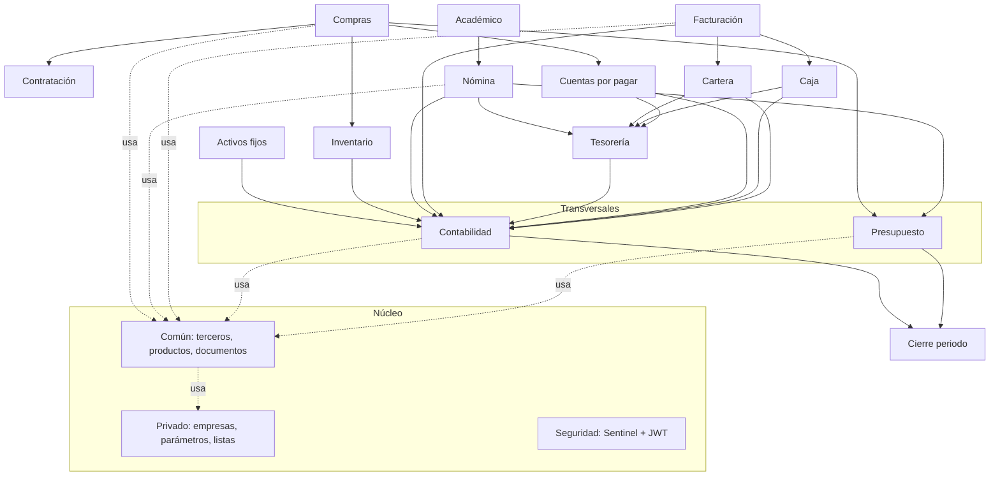

# Fase 4 — Análisis de dependencias y acoplamiento

## 4.1 Tablas maestras (compartidas por casi todos)

| Maestra | La consumen | Naturaleza |
|---|---|---|
| `com_terceros` | Nómina, Facturación, CxP, Cartera, Compras, Tesorería, Contabilidad | Maestro de personas/entidades |
| `com_productos` (+ variantes) | Inventario, Compras, Facturación | Catálogo de bienes/servicios |
| `com_sedes` / `prv_empresas` | **Todos** | Multisede / multiempresa |
| `com_centros_costos` / `com_subcentros` / `com_proyectos` | Todos los transaccionales | Ejes de costo |
| `com_vigencias` | Todos | Año fiscal (vigencia) |
| `con_plan_contable` | Todos los que generan asiento | Plan único de cuentas |
| `pre_planes_presupuestales` / `pre_cpcs` | Compras, Nómina, CxP, Tesorería | Estructura presupuestal |
| `com_documentos` / `com_documentos_consecutivos` | Todos | Tipos de documento y numeración |
| `prv_listas_elementos` | Transversal | Catálogo genérico parametrizable |

## 4.2 Procesos transversales (cross-cutting)

- **Vigencias:** apertura/cierre habilita o bloquea operaciones en cada módulo.
- **Documento + workflow + consecutivo:** patrón único de transacción para todos.
- **Auditoría / colas / notificaciones:** servicios comunes.
- **Interfaz contable y presupuestal:** todo módulo transaccional escribe en
  `*_detalles_contabilidad` y `*_detalles_presupuesto`.

## 4.3 Integraciones clave (quién alimenta a quién)

```
Compras ─┬─► Presupuesto (compromiso)        Nómina ─┬─► Presupuesto
         ├─► Inventario (entrada)                    ├─► Contabilidad
         └─► CxP ─► Tesorería ─► Contabilidad        └─► Tesorería
Académico ─► Nómina (carga docente)
Facturación ─┬─► Cartera ─► Caja/Tesorería
             └─► Contabilidad + Presupuesto (ingreso)
Activos fijos ─► Contabilidad (depreciación)
TODOS ─► Contabilidad (asiento) y ─► Presupuesto (afectación)
         └─► Cierre (con_cierres_contables / pre_cierres / adm_cierres_mes)
```

🧠 **Contabilidad y Presupuesto son los dos grandes sumideros**: reciben interfaces de todos.
**Tesorería** es el sumidero de pagos; **Cartera/Caja** el de recaudos.

## 4.4 Diagrama de dependencias entre módulos (Mermaid)



## 4.5 Riesgos de acoplamiento detectados

| Riesgo | Evidencia | Impacto |
|---|---|---|
| **Acoplamiento por tabla compartida** | Todos leen/escriben `com_encabezados_documentos` y maestros `com_*` | Un cambio en el núcleo afecta a todos; despliegues riesgosos |
| **Frontera de módulo violada** | `nom_*` creada desde Académico; `ctr_contratos` desde Inventario *y* Contratación; pólizas `com_*` desde Compras | Imposible aislar/extraer un módulo |
| **Módulo `Custom` global** | 194 migraciones que alteran tablas de cualquier módulo | Punto único de acoplamiento y deuda |
| **Acoplamiento por FK retroactiva** | FKs agregadas en 2024-25 sobre datos preexistentes | Riesgo de inconsistencias históricas |
| **Dependencia circular potencial** | Documento ↔ referencias ↔ workflow ↔ interfaces que vuelven a referenciar documento | Difícil borrado/reversa transaccional |
| **EAV transversal** (`prv_listas_*`) | Catálogo único consumido por todos por id mágico | Acopla semántica de negocio a filas de configuración |

🟢 *Propuesta:* en el ERP nuevo, **prohibir tablas compartidas entre módulos**; comunicar por
**eventos de dominio** y **APIs internas**; los maestros (terceros, plan contable, presupuesto)
se exponen como **servicios del núcleo** con contrato estable, no como tablas escribibles por todos.
