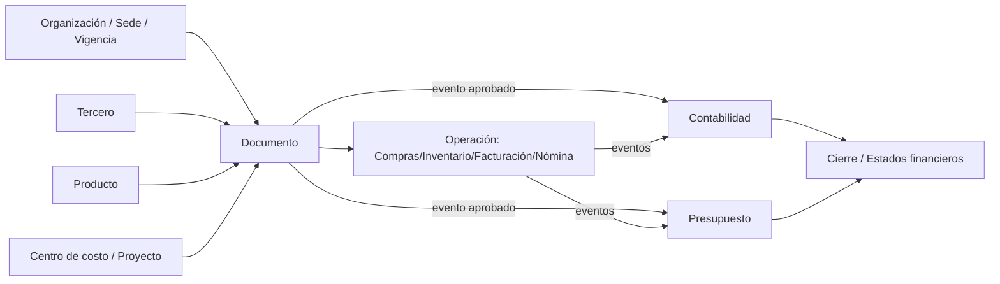
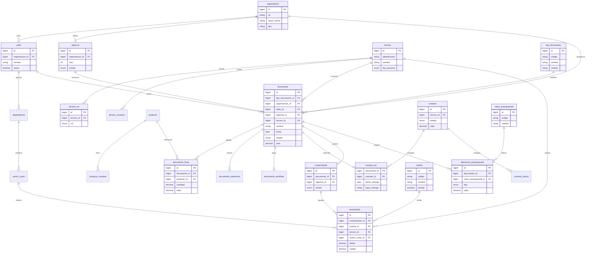

# Fase 6 — Propuesta de arquitectura del nuevo ERP

> 🟢 **Propuesta propia**, no copia. Primero el *concepto de negocio*, luego un diseño mejorado.
> Los nombres son **nuevos** y se justifican como conceptos estándar de negocio.

## 6.1 Principios de diseño

1. **Bounded contexts (módulos) con frontera dura.** Cada módulo posee sus tablas; **nadie escribe
   en tablas de otro módulo**. Comunicación por **eventos de dominio** + **APIs internas**.
2. **Núcleo de dominio explícito** (no tabla-Dios). Un documento base tipado + extensiones por tipo.
3. **Integridad referencial desde el día 1** (FK, `unique`, `check`, enums nativos).
4. **Multitenencia (organización) y multisede** como atributos de primer nivel.
5. **Vigencias** como dimensión fiscal de primer nivel.
6. **Inmutabilidad contable:** los movimientos son *append-only*; los saldos son **proyecciones**
   reconstruibles, no la fuente de verdad.
7. **Catálogos tipados por dominio** en lugar de EAV genérico.
8. **Auditoría y trazabilidad uniformes** (event log + auditoría de cambios en todo el sistema).
9. **Estados como máquinas de estado explícitas** (enums + transiciones validadas).
10. **Datos sensibles (salud) aislados y cifrados**, módulo clínico opcional.

## 6.2 Mapa de módulos propuesto

| Capa | Módulo nuevo | Concepto de negocio que cubre |
|---|---|---|
| **Plataforma** | `Identidad y Acceso` | Usuarios, roles, permisos, sesiones, auditoría de acceso |
| | `Organización` | Organizaciones (tenant), sedes, dependencias, periodos/vigencias |
| | `Catálogos Maestros` | Terceros, productos/servicios, centros de costo, proyectos, listas tipadas |
| | `Documentos` | Tipos de documento, numeración, estados, workflow, adjuntos, eventos |
| **Finanzas núcleo** | `Contabilidad` | Plan de cuentas, asientos, saldos (proyección), cierres, estados financieros, exógena |
| | `Presupuesto` | Plan presupuestal, CDP/compromiso/obligación/pago, fuentes, PAC, cierres |
| | `Tesorería` | Bancos, chequeras, egresos, conciliación |
| | `Caja` | Recaudo en punto, arqueo |
| | `Cartera` | Cuentas por cobrar, acuerdos de pago, edades |
| | `Cuentas por Pagar` | Recepción facturas proveedor (DIAN/RADIAN), obligaciones |
| **Operación** | `Compras y Contratación` | Plan de adquisiciones, estudios previos, contratos, pólizas |
| | `Inventario` | Bodegas, lotes, movimientos, kardex valorizado |
| | `Activos Fijos` | Ciclo de vida y depreciación |
| | `Facturación` | Facturación electrónica, tarifas, recaudo |
| **Capital humano** | `Nómina` | Liquidación, conceptos, novedades, seguridad social |
| | `Talento Humano` | Hoja de vida, evaluación de desempeño, disciplinarios |
| **Verticales (opcionales)** | `Académico` | Programas, asignaturas, carga docente (universidades) |
| | `Clínico/Salud` | Atenciones, contratos EPS, copagos, autorizaciones, capitación (IPS) |
| | `Privados/Especializados` | Extensiones por cliente, sin tocar el núcleo |

🧠 **Justificación de nombres estándar:** *Terceros, Plan de cuentas, Centro de costo, Vigencia,
Comprobante, CDP, Compromiso, Obligación* son términos contables/presupuestales estándar
(especialmente sector público colombiano), no copias del sistema: se conservan por ser vocabulario
de negocio, pero las **estructuras** se rediseñan.

## 6.3 Detalle por módulo

### Organización (plataforma)
- **Objetivo:** soportar multitenencia, multisede y periodos fiscales.
- **Entidades:** `organizacion`, `sede`, `dependencia`, `vigencia`, `vigencia_apertura`.
- **Relaciones:** raíz de todo; cada documento referencia `organizacion`, `sede`, `vigencia`.
- **Reglas:** una operación solo es válida si su `vigencia` está *abierta* para esa `sede`.
- **Estados (vigencia):** `planeada → abierta → en_cierre → cerrada`.
- **Eventos:** `VigenciaAbierta`, `VigenciaCerrada`, `SedeHabilitada`.

### Catálogos Maestros
- **Objetivo:** datos maestros únicos y consistentes.
- **Entidades:** `tercero` (+ `tercero_rol`: cliente/proveedor/empleado/paciente), `producto`
  (+ `producto_variante`), `centro_costo`, `proyecto`, `lista`/`lista_item` (catálogo tipado).
- **Reglas:** un tercero tiene N roles sin duplicarse; producto activo por vigencia.
- **Eventos:** `TerceroCreado`, `ProductoActualizado`.
- **Mejora vs. actual:** separa **rol** de **identidad** (hoy todo en `com_terceros`); catálogos
  con FK en vez de EAV.

### Documentos (motor genérico tipado)
- **Objetivo:** unidad transaccional común, **sin tabla-Dios**.
- **Patrón:** `documento` (base mínima: tipo, número, fecha, sede, vigencia, tercero, estado,
  totales) **+ tabla de detalle por tipo** **+ tabla de extensión por dominio**
  (p. ej. `documento_compra_ext`, `documento_factura_ext`) en lugar de 50 columnas en una sola tabla.
- **Estados:** `borrador → en_aprobacion → aprobado → contabilizado → cerrado / anulado`.
- **Eventos:** `DocumentoAprobado`, `DocumentoContabilizado`, `DocumentoAnulado` → disparan
  interfaces contables/presupuestales en los módulos suscritos.
- **Numeración:** servicio de consecutivos por (tipo, sede, vigencia) con transacción atómica.

### Contabilidad
- **Entidades:** `cuenta` (plan), `comprobante`, `movimiento` (partida, *append-only*),
  `saldo_proyeccion` (materializado/recalculable por ejes), `cierre`, `estado_financiero`.
- **Reglas:** todo comprobante cuadra (débito = crédito); no se edita un movimiento, se reversa.
- **Estados (comprobante):** `borrador → confirmado → reversado`.
- **Eventos:** `ComprobanteConfirmado`.
- **Mejora:** saldos como **proyección** reconstruible (no fuente de verdad) → elimina descuadres.

### Presupuesto
- **Entidades:** `plan_presupuestal`, `rubro`, `cdp`, `compromiso`, `obligacion`, `pago_presup`,
  `fuente_financiamiento`, `pac`.
- **Reglas:** cadena CDP→Compromiso→Obligación→Pago con saldos disponibles validados.
- **Estados:** por documento de la cadena.
- **Eventos:** `CompromisoRegistrado`, `ObligacionRegistrada`.

### Tesorería / Caja / Cartera / CxP
- **Tesorería:** `cuenta_bancaria`, `egreso`, `chequera`, `conciliacion`, `extracto`.
- **Caja:** `caja`, `recibo_caja`, `arqueo`.
- **Cartera:** `cuenta_por_cobrar`, `acuerdo_pago`, `edad_cartera` (vista/proyección).
- **CxP:** `factura_proveedor`, `evento_dian`, `obligacion_pago`.
- **Eventos:** `RecaudoRegistrado`, `PagoRealizado`, `FacturaProveedorRecibida`.

### Compras y Contratación
- **Entidades:** `plan_adquisicion`, `estudio_previo`, `cuadro_comparativo`, `contrato`
  (+ `clausula`, `poliza`), `orden_compra`.
- **Reglas:** orden solo con disponibilidad presupuestal (CDP).
- **Estados (contrato):** `planeado → adjudicado → suscrito → en_ejecucion → liquidado`.

### Inventario / Activos Fijos
- **Inventario:** `bodega`, `lote`, `movimiento_inventario` (append-only), `kardex` (proyección).
- **Activos:** `activo`, `depreciacion`, `responsable`, `poliza`.
- **Eventos:** `MovimientoInventarioRegistrado`, `DepreciacionCalculada`.

### Facturación
- **Entidades:** `factura`, `tarifa`, `manual_tarifario`, `resolucion_dian`, `recaudo`.
- **Estados:** `borrador → emitida → aceptada_dian → recaudada / anulada`.
- **Eventos:** `FacturaEmitida`, `FacturaAceptadaDIAN`.

### Nómina / Talento Humano
- **Nómina:** `proceso_nomina`, `concepto`, `novedad`, `liquidacion` (+ `detalle`),
  `aporte_seguridad_social` (PILA).
- **THU:** `empleado`, `hoja_vida`, `evaluacion`, `proceso_disciplinario`.
- **Estados (proceso):** `abierto → liquidado → revisado → contabilizado → cerrado`.

### Verticales (Académico / Clínico)
- **Académico:** `programa`, `asignatura`, `grupo`, `carga_docente` → emite evento que **Nómina**
  consume para liquidar catedráticos.
- **Clínico:** `atencion`, `contrato_eps`, `copago`, `autorizacion`, `capitacion` → emite eventos
  que **Facturación** consume. **Datos sensibles cifrados y aislados.**

## 6.4 Modelo conceptual (alto nivel, Mermaid)

## 6.5 Modelo lógico — diagrama entidad-relación (Mermaid)

> Núcleo + un módulo operativo de ejemplo (Compras→Contabilidad) para ilustrar el patrón.
> Nombres nuevos, en `snake_case`, con FK explícitas.

## 6.6 Recomendaciones técnicas transversales

- **Stack al día:** framework y lenguaje con soporte vigente; PostgreSQL como motor principal
  (constraints ricos, JSONB, particionado) + cola/event bus para eventos de dominio.
- **Migraciones limpias y versionadas por módulo**, con FK/índices desde el inicio.
- **Capa de aplicación CQRS ligera:** comandos validan reglas; proyecciones (saldos/kardex/edades)
  se reconstruyen desde eventos/movimientos.
- **Multitenancy** por columna `organizacion_id` + *row-level security* (o esquema por tenant según escala).
- **Auditoría universal** (no opcional) y **event store** para trazabilidad.
- **Catálogos tipados**; reservar JSON/JSONB solo para extensiones realmente dinámicas y documentadas.
- **Estados como enums** con tabla de transiciones válidas.
- **Cifrado** de datos clínicos/biométricos; módulo clínico desacoplado y opcional.
