# Fase 9 — Validación y diseño del MVP

> **Propósito.** Convertir el análisis preliminar (docs 00–08) en un **diseño ejecutable y acotado**:
> un MVP de ERP construido como **monolito modular** (Spring Boot + Angular + PostgreSQL).
> Esta fase **no propone aún todos los módulos del ERP**; selecciona un subconjunto operable de
> punta a punta y define con precisión sus límites, datos, reglas y dependencias.
>
> **Metodología (continúa la de las fases previas):**
> 🔎 **Observado** (en el código del ERP de referencia) ·
> 🧠 **Interpretación** (negocio) ·
> 🟢 **Propuesta** (diseño nuevo) ·
> ❓ **A validar** (requiere la base de datos viva o decisión humana antes de migrar).
>
> **Cambio de alcance respecto a Fase 6–8.** Las fases anteriores sugerían *event store*, *bus de
> eventos* y *CQRS completo*. Para la **primera versión** esto se **descarta deliberadamente**
> (ver [§6 Decisiones arquitectónicas](#6-decisiones-arquitectónicas-justificadas)). Los "eventos"
> de cada módulo se implementan como **eventos de dominio in-process** (publicación/consumo dentro
> del mismo proceso), no como infraestructura distribuida.
>
> **Nombres.** Todos los nombres de tablas/entidades son **nuevos** y responden a vocabulario
> contable/comercial estándar. No se copian prefijos (`com_`, `fac_`, …), columnas genéricas
> (`fecha1`, `com_tercero1_id`) ni estructuras particulares del ERP de referencia.

---

## 1. Hallazgos confirmados por código vs. hallazgos a validar sobre la BD viva

Todo el análisis 00–08 fue **estático**: se leyeron migraciones, modelos y controladores, **sin
ejecutar una sola consulta sobre la base de datos en producción**. Por tanto, los hallazgos se
parten en dos grupos y **el segundo bloquea las migraciones** hasta validarse.

### 1.1 ✅ Confirmado por el código (no requiere la BD viva)

| # | Hallazgo confirmado | Fuente de la evidencia |
|---|---|---|
| C1 | Existe una **tabla-Dios de documentos** (`com_encabezados_documentos`, ~50 columnas heterogéneas). | Migración `Schema::create` leída directamente ([00](00-README-resumen-ejecutivo.md), [05](05-evaluacion-calidad.md)). |
| C2 | La **integridad referencial es débil por diseño**: solo ~329/1.647 migraciones (~20%) declaran `->foreign(`, y ~59% de esas FK están en el módulo `Custom`. | Conteo sobre archivos de migración ([01 §1.6](01-inventario-tecnico.md)). |
| C3 | **Borrado lógico generalizado** (`softDeletes` en 1.572 migraciones). | Conteo de migraciones ([05](05-evaluacion-calidad.md)). |
| C4 | **Multiempresa y multisede** son transversales (`empresa_id` ×1.222, `sede_id` ×750). | Conteo de referencias ([00](00-README-resumen-ejecutivo.md)). |
| C5 | **No hay lógica en BD**: 0 `CREATE VIEW/PROCEDURE/FUNCTION/TRIGGER`; numeración y saldos viven en PHP. | Búsqueda en migraciones ([01 §1.9](01-inventario-tecnico.md)). |
| C6 | El módulo `Custom` **viola fronteras** (recrea/altera tablas de otros módulos). | Listado de migraciones de `Custom` ([02](02-clasificacion-modulos.md), [05](05-evaluacion-calidad.md)). |
| C7 | **Tablas duplicadas entre módulos** (`ctr_contratos` en Inventario y Contratación). | Dos `Schema::create` con el mismo nombre ([05](05-evaluacion-calidad.md)). |
| C8 | **Estados como `tinyInteger` sin enum** ni máquina formal. | Tipo de columna `estado` en migraciones ([01 §1.4](01-inventario-tecnico.md)). |
| C9 | **Auditoría parcial** (owen-it en ~150/369 modelos). | Conteo de traits/modelos ([01 §1.10](01-inventario-tecnico.md)). |
| C10 | El stack está **fuera de soporte** (Laravel 5.7 / PHP 7.1). | `composer.json` / config ([05](05-evaluacion-calidad.md)). |
| C11 | Patrón **interfaces contables/presupuestales** replicado por módulo (`*_detalles_contabilidad`, `*_detalles_presupuesto`). | Nombres de tablas por módulo ([04 §4.2](04-dependencias.md)). |
| C12 | **Saldos materializados** existen (`con_saldos_*`, `inv_saldos_productos`). | Nombres de tablas ([05](05-evaluacion-calidad.md)). |

> 🧠 Estos hallazgos describen el **diseño** del sistema. Son ciertos sobre el esquema tal como lo
> declara el código, independientemente de los datos.

### 1.2 ❓ A validar sobre la base de datos viva (bloquean migración y, algunos, el diseño de tablas)

Estos hallazgos son **inferencias** del análisis estático. Antes de escribir migraciones del MVP
hay que confirmarlos con consultas **de solo lectura** sobre una **réplica** de la BD (nunca sobre
producción, y sin DDL/DML).

| # | Inferencia a validar | Pregunta de validación (read-only) | Qué cambia según el resultado |
|---|---|---|---|
| V1 | Hay **datos huérfanos** por falta de FK histórica. | Para cada `*_id` candidato, `COUNT` de filas cuyo `*_id` no existe en la maestra. | Define el esfuerzo y las reglas de saneamiento previas a la migración. |
| V2 | Los **saldos materializados se descuadran** frente a los movimientos. | Comparar `con_saldos_*`/`inv_saldos_productos` contra la suma de movimientos por eje. | Decide si los saldos del ERP actual se migran o se **recalculan** desde movimientos. |
| V3 | Varios **módulos están abandonados** (placeholders sin uso real). | `COUNT(*)` y `MAX(created_at/updated_at)` por tabla; tablas vacías o sin escritura reciente. | Excluye del MVP y de la migración lo que no se usa en producción. |
| V4 | El **dominio real** es salud+educación, pero el cliente objetivo puede ser otro. | ¿Qué tipos de documento (`com_documentos`) tienen volumen? ¿Hay datos clínicos/académicos vivos? | Confirma que el MVP comercial propuesto es el alcance correcto. |
| V5 | Los **valores de `estado`** (enteros) tienen un significado por tipo de documento. | `SELECT DISTINCT estado, COUNT(*)` por tipo de documento. | Define las **máquinas de estado** reales (hoy implícitas en PHP). |
| V6 | La **numeración** reinicia por vigencia/sede y usa prefijos. | Inspeccionar `com_documentos_consecutivos` y patrones de `numero` por tipo/sede/vigencia. | Define las reglas del servicio de consecutivos. |
| V7 | La **precisión monetaria** real usada es `decimal(20,5)`. | Rango y escala efectiva de montos en tablas transaccionales. | Confirma `NUMERIC(19,4)`/`(20,5)` en el diseño nuevo. |
| V8 | El **catálogo de impuestos/retenciones** y el plan de cuentas en uso. | Filas activas en `com_impuestos_*` y `con_plan_contable`; cuáles se usan. | Datos semilla del MVP de Contabilidad/Facturación. |
| V9 | Multitenencia real: ¿cuántas **organizaciones/sedes** activas? | `COUNT(DISTINCT empresa_id)`, `COUNT(DISTINCT sede_id)` con actividad. | Decide BD-compartida-con-`organizacion_id` vs. esquema/BD por tenant. |
| V10 | Volumen y antigüedad para dimensionar **migración** y rendimiento. | Tamaño de las tablas grandes (`com_encabezados_documentos`, detalles, movimientos). | Estrategia de migración (big-bang vs. por fases) e índices. |

> 🟢 **Regla de oro de la fase:** ningún hallazgo del grupo 1.2 se trata como hecho en el diseño de
> migraciones. Se valida primero contra una **réplica de solo lectura**; el resultado se documenta
> y recién entonces se congela el esquema. Esto preserva la disciplina "sin DDL/DML" de las fases
> anteriores.

---

## 2. Arquitectura del MVP: monolito modular (Spring Boot + Angular + PostgreSQL)

### 2.1 Forma del sistema

```
┌──────────────────────────────────────────────────────────────┐
│                      Angular (SPA)                            │
│   Un frontend; lazy-loading por módulo de negocio             │
└───────────────────────────┬──────────────────────────────────┘
                            │ REST/JSON (un solo gateway HTTP)
┌───────────────────────────▼──────────────────────────────────┐
│              Spring Boot — UN despliegue (monolito)           │
│                                                              │
│  Paquetes por módulo (bounded context), frontera lógica dura: │
│   administracion │ comun │ compras │ inventario │ facturacion │
│   caja │ cartera │ contabilidad                               │
│                                                              │
│  Reglas de frontera:                                          │
│   • Cada módulo expone una API interna (interfaces/servicios).│
│   • Ningún módulo accede a tablas de otro módulo por SQL.     │
│   • La comunicación asíncrona usa eventos de dominio          │
│     IN-PROCESS (ApplicationEventPublisher / @TransactionalEventListener). │
└───────────────────────────┬──────────────────────────────────┘
                            │ JDBC
┌───────────────────────────▼──────────────────────────────────┐
│           PostgreSQL — UNA base de datos                      │
│   Un esquema por módulo (administracion, comun, compras, …)   │
│   FK permitidas DENTRO del esquema y desde un módulo hacia el │
│   núcleo (administracion/comun). No al revés.                 │
└──────────────────────────────────────────────────────────────┘
```

### 2.2 Qué se conserva del análisis y qué se acota para v1

| Concepto de Fase 6–8 | Decisión para el MVP (v1) |
|---|---|
| Bounded contexts con frontera dura | **Sí**, pero como **paquetes/esquemas** en un solo proceso (no servicios). |
| Comunicación por eventos de dominio | **Sí**, pero **in-process** (Spring events), no bus distribuido. |
| Event store / event sourcing | **No** en v1. Las tablas son el estado actual; hay auditoría de cambios. |
| CQRS completo | **No** en v1. Lecturas y escrituras sobre el mismo modelo; las "proyecciones" (saldos, kardex, edades) son **tablas derivadas recalculables**, no un read-model separado por bus. |
| Microservicios | **No** en v1. Monolito modular desplegable como una unidad. |
| Integridad referencial desde día 1 | **Sí**, sin excepción (FK, `unique`, `check`, enums). |
| Multitenencia + multisede + vigencias | **Sí**, como atributos de primer nivel del núcleo. |
| Borrado lógico | **Sí** (`deleted_at`), pero **prohibido** en tablas append-only de contabilidad/inventario. |

> 🧠 **Por qué monolito modular primero:** el ERP de referencia fracasó en mantenibilidad no por
> falta de servicios distribuidos, sino por **fronteras blandas** (tablas compartidas, módulo
> `Custom`, FK ausentes). El monolito modular ataca exactamente esa causa raíz con un costo
> operativo bajo, y deja la puerta abierta a extraer módulos a servicios **si** el volumen lo exige.
> La frontera bien trazada hoy es lo que hace barata esa extracción mañana.

---

## 3. Módulos propietarios y módulos consumidores

> Regla: **cada entidad tiene exactamente un módulo propietario** (único que la escribe). Los demás
> módulos son **consumidores**: la leen vía la API interna del dueño o reaccionan a sus eventos.
> Esto elimina el antipatrón de tabla compartida ([04 §4.5](04-dependencias.md)).

| Entidad (agrupada) | Módulo **propietario** (escribe) | Módulos **consumidores** (leen / reaccionan) |
|---|---|---|
| Organización, sede, usuario, rol, permiso, **vigencia/periodo**, parámetro, auditoría | **Administración** | Todos |
| Tercero (+ rol), producto, unidad de medida, centro de costo, impuesto, lista tipada, **tipo de documento + consecutivo** | **Común** | Todos los transaccionales |
| Plan de cuentas, comprobante, movimiento contable, saldo contable (derivado), periodo contable | **Contabilidad** | Lectura para reportes; recibe interfaces de los demás |
| Orden de compra, recepción | **Compras** | Inventario (entrada), Contabilidad |
| Bodega, movimiento de inventario, saldo de inventario (derivado) | **Inventario** | Compras, Facturación (disponibilidad), Contabilidad |
| Factura de venta, resolución DIAN, ítem de factura | **Facturación** | Cartera, Inventario (salida), Contabilidad |
| Cuenta por cobrar, acuerdo de pago, aplicación de recaudo | **Cartera** | Caja, Contabilidad |
| Caja, recibo de caja, arqueo | **Caja** | Cartera (aplica recaudo), Contabilidad |

**Dirección de dependencias permitida (acíclica):**

```
Administración  ◄── Común  ◄── Compras ──► Inventario
        ▲             ▲           │             │
        │             │           ▼             ▼
        └──── Facturación ──► Cartera ──► Caja   │
                  │             │          │     │
                  ▼             ▼          ▼     ▼
                Contabilidad  (recibe interfaces de todos)
```

- Administración y Común son el **núcleo**: nadie depende de los módulos transaccionales para existir.
- Contabilidad es **sumidero**: depende del núcleo pero los transaccionales le envían interfaces
  por evento; Contabilidad no conoce a Compras/Facturación (solo recibe asientos tipados).

---

## 4. Módulos del MVP (detalle)

Para cada módulo: **Objetivo · Entidades · Responsabilidades · Reglas de negocio · Estados ·
Dependencias · Eventos · Tablas propuestas**. Las tablas usan `snake_case`, PK `bigint id`,
auditoría (`created_at`, `updated_at`, `created_by`, `updated_by`) y, salvo append-only,
`deleted_at`. Toda tabla transaccional lleva `organizacion_id` y, donde aplique, `sede_id` y
`vigencia_id`.

---

### 4.1 Administración

- **Objetivo.** Plataforma del ERP: multitenencia, multisede, periodos fiscales (vigencias),
  identidad/acceso, parámetros y auditoría universal.
- **Entidades.** `organizacion`, `sede`, `usuario`, `rol`, `permiso`, `rol_permiso`,
  `usuario_rol`, `vigencia`, `parametro`, `auditoria`.
- **Responsabilidades.**
  - Registrar organizaciones (tenants) y sus sedes.
  - Gestionar usuarios, roles y permisos (RBAC).
  - Abrir/cerrar vigencias y exponer "¿está abierta esta vigencia para esta sede?".
  - Parámetros del sistema y **auditoría de cambios** centralizada (obligatoria, no opcional).
- **Reglas de negocio.**
  - RA1: Toda operación de cualquier módulo pertenece a una `organizacion`, una `sede` y una `vigencia`.
  - RA2: Una operación transaccional solo es válida si su `vigencia` está **abierta** (no cerrada/planeada).
  - RA3: Un usuario solo opera sobre sedes a las que está habilitado.
  - RA4: Toda escritura de negocio genera un registro de auditoría (quién, qué, cuándo, antes/después).
- **Estados.** `vigencia`: `planeada → abierta → en_cierre → cerrada` (irreversible salvo reapertura controlada con permiso).
- **Dependencias.** Ninguna (es la raíz).
- **Eventos.** Publica `VigenciaAbierta`, `VigenciaCerrada`, `SedeHabilitada`. Consumidos por todos
  los módulos para habilitar/bloquear operación.
- **Tablas propuestas.**

| Tabla | Notas |
|---|---|
| `administracion.organizacion` | `id, nit, razon_social, tipo_persona, activo` |
| `administracion.sede` | `id, organizacion_id FK, codigo, nombre, activa` |
| `administracion.usuario` | `id, organizacion_id FK, username, email, hash_password, activo` |
| `administracion.rol` | `id, organizacion_id FK, nombre` |
| `administracion.permiso` | `id, codigo, descripcion` |
| `administracion.rol_permiso` | `rol_id FK, permiso_id FK` (PK compuesta) |
| `administracion.usuario_rol` | `usuario_id FK, rol_id FK, sede_id FK` |
| `administracion.vigencia` | `id, organizacion_id FK, anio, estado, fecha_apertura, fecha_cierre` |
| `administracion.parametro` | `id, organizacion_id FK, clave, valor, tipo_dato` |
| `administracion.auditoria` | `id, organizacion_id FK, usuario_id, entidad, entidad_id, accion, valores_antes JSONB, valores_despues JSONB, fecha` |

---

### 4.2 Común

- **Objetivo.** Datos maestros y catálogos compartidos, con integridad fuerte y **sin EAV genérico**.
  Incluye el **motor mínimo de documentos** (tipos + consecutivos).
- **Entidades.** `tercero`, `tercero_rol`, `producto`, `unidad_medida`, `centro_costo`, `impuesto`,
  `lista`, `lista_item`, `tipo_documento`, `consecutivo`.
- **Responsabilidades.**
  - Maestro **único** de terceros (cliente/proveedor/empleado) separando **identidad** de **rol**.
  - Catálogo de productos/servicios con unidad de medida e impuestos asociados.
  - Centros de costo (eje de imputación).
  - Catálogos **tipados** (`lista`/`lista_item`) en reemplazo del EAV `prv_listas_*`.
  - Definir tipos de documento y entregar **consecutivos transaccionales** por (tipo, sede, vigencia).
- **Reglas de negocio.**
  - RC1: Un tercero tiene 1..N roles; no se duplica la identidad por rol (mejora vs. `com_terceros`).
  - RC2: La numeración de un documento es **única** por (tipo_documento, sede, vigencia) y se asigna
    de forma atómica (transacción + bloqueo de fila del consecutivo).
  - RC3: Un producto referencia su unidad e impuestos; un impuesto tiene tarifa vigente por vigencia.
  - RC4: Identificación de tercero **única** por organización.
- **Estados.** `tercero`/`producto`: `activo ↔ inactivo` (no se borran físicamente).
- **Dependencias.** Administración (organización, sede, vigencia).
- **Eventos.** Publica `TerceroCreado`, `ProductoActualizado`. (Consumo bajo; son maestros.)
- **Tablas propuestas.**

| Tabla | Notas |
|---|---|
| `comun.tercero` | `id, organizacion_id FK, identificacion, tipo_identificacion, tipo_persona, nombre, activo` · `unique(organizacion_id, identificacion)` |
| `comun.tercero_rol` | `id, tercero_id FK, rol` (`cliente`/`proveedor`/`empleado`) · `unique(tercero_id, rol)` |
| `comun.unidad_medida` | `id, codigo, nombre` |
| `comun.producto` | `id, organizacion_id FK, codigo, nombre, tipo` (`bien`/`servicio`)`, unidad_medida_id FK, maneja_inventario bool, activo` |
| `comun.impuesto` | `id, codigo, nombre, tipo` (`iva`/`retencion`)`, tarifa, vigencia_id FK` |
| `comun.producto_impuesto` | `producto_id FK, impuesto_id FK` |
| `comun.centro_costo` | `id, organizacion_id FK, codigo, nombre, padre_id FK NULL` (jerárquico) |
| `comun.lista` | `id, codigo, nombre` (catálogo tipado) |
| `comun.lista_item` | `id, lista_id FK, codigo, valor` |
| `comun.tipo_documento` | `id, modulo, codigo, nombre, prefijo, reinicia_por_vigencia bool` |
| `comun.consecutivo` | `id, tipo_documento_id FK, sede_id FK, vigencia_id FK, ultimo_numero` · `unique(tipo_documento_id, sede_id, vigencia_id)` |

---

### 4.3 Compras

- **Objetivo.** Adquisición de bienes/servicios a proveedores y su recepción al inventario.
- **Entidades.** `orden_compra`, `orden_compra_linea`, `recepcion`, `recepcion_linea`.
- **Responsabilidades.**
  - Emitir órdenes de compra a un proveedor (tercero con rol `proveedor`).
  - Registrar recepción (total o parcial) que **alimenta inventario**.
  - Enviar interfaz contable de la causación de compra.
- **Reglas de negocio.**
  - RCo1: La orden referencia productos del catálogo de Común y un proveedor válido.
  - RCo2: La recepción no puede exceder la cantidad pendiente de la orden.
  - RCo3: Confirmar/recibir requiere vigencia abierta (RA2).
  - RCo4: Solo se contabiliza/recibe una orden **aprobada**.
- **Estados.** `orden_compra`: `borrador → aprobada → recibida_parcial → recibida_total → cerrada / anulada`.
- **Dependencias.** Común (producto, tercero, tipo_documento/consecutivo), Administración (vigencia/sede),
  Inventario (consume la recepción), Contabilidad (interfaz).
- **Eventos.** Publica `OrdenCompraAprobada`, `RecepcionRegistrada` (→ Inventario crea entrada,
  → Contabilidad causa). Consume `VigenciaCerrada` (bloqueo).
- **Tablas propuestas.**

| Tabla | Notas |
|---|---|
| `compras.orden_compra` | `id, organizacion_id, sede_id, vigencia_id, tipo_documento_id, numero, proveedor_id, fecha, estado, total` |
| `compras.orden_compra_linea` | `id, orden_compra_id FK, producto_id, cantidad, valor_unitario, valor_impuesto, valor_linea` |
| `compras.recepcion` | `id, orden_compra_id FK, bodega_id, fecha, estado` |
| `compras.recepcion_linea` | `id, recepcion_id FK, orden_compra_linea_id FK, cantidad_recibida` |

---

### 4.4 Inventario

- **Objetivo.** Controlar existencias por bodega con **movimientos append-only** y saldo/kardex
  como **proyección recalculable** (no como fuente de verdad descuadrable).
- **Entidades.** `bodega`, `movimiento_inventario`, `saldo_inventario` (derivada).
- **Responsabilidades.**
  - Registrar entradas (recepción de compras), salidas (facturación) y ajustes.
  - Mantener saldo por (producto, bodega) recalculable desde los movimientos.
  - Valorizar el inventario (costo promedio) y enviar interfaz contable.
- **Reglas de negocio.**
  - RInv1: Un `movimiento_inventario` es **inmutable**; un error se corrige con un movimiento de reversa.
  - RInv2: No se permite saldo negativo en salidas (configurable por parámetro).
  - RInv3: `saldo_inventario` siempre es reconstruible: `entradas − salidas` por (producto, bodega).
  - RInv4: La salida por venta se dispara desde Facturación, no se digita suelta.
- **Estados.** El `movimiento_inventario` no tiene máquina de estados (es un hecho registrado);
  el periodo de inventario sí: `abierto → cerrado` (al cierre no se aceptan movimientos con fecha previa).
- **Dependencias.** Común (producto), Administración (sede/vigencia), Compras (entradas),
  Facturación (salidas), Contabilidad (interfaz).
- **Eventos.** Consume `RecepcionRegistrada` (entrada) y `FacturaEmitida` (salida). Publica
  `MovimientoInventarioRegistrado` (→ Contabilidad valoriza).
- **Tablas propuestas.**

| Tabla | Notas |
|---|---|
| `inventario.bodega` | `id, organizacion_id, sede_id, codigo, nombre, activa` |
| `inventario.movimiento_inventario` | `id, organizacion_id, bodega_id, producto_id, tipo` (`entrada`/`salida`/`ajuste`)`, cantidad, costo_unitario, fecha, origen_modulo, origen_id` — **append-only, sin `deleted_at`** |
| `inventario.saldo_inventario` | `producto_id, bodega_id, cantidad, costo_promedio, fecha_recalculo` — **derivada/recalculable** |

---

### 4.5 Facturación

- **Objetivo.** Emitir facturas de venta a clientes, descontar inventario y generar cuenta por cobrar.
- **Entidades.** `factura`, `factura_linea`, `resolucion_dian`.
- **Responsabilidades.**
  - Emitir facturas con numeración por resolución/consecutivo.
  - Calcular impuestos por línea (desde Común).
  - Disparar salida de inventario y creación de cartera; enviar interfaz contable (ingreso).
- **Reglas de negocio.**
  - RF1: La factura referencia un cliente (tercero rol `cliente`) y productos del catálogo.
  - RF2: La numeración respeta la `resolucion_dian` vigente y el consecutivo (RC2).
  - RF3: Emitir requiere vigencia abierta y disponibilidad de inventario para productos que lo manejan.
  - RF4: Una factura **emitida** no se edita; se **anula** con nota (y se reversa cartera/inventario).
- **Estados.** `factura`: `borrador → emitida → anulada`. (Estados DIAN como
  `aceptada/rechazada` se difieren a una fase posterior; ver ❓ en §7.)
- **Dependencias.** Común (cliente, producto, impuesto, consecutivo), Administración (vigencia/sede),
  Inventario (salida), Cartera (CxC), Contabilidad (interfaz).
- **Eventos.** Publica `FacturaEmitida` (→ Inventario salida, → Cartera crea CxC, → Contabilidad
  asiento), `FacturaAnulada` (→ reversas).
- **Tablas propuestas.**

| Tabla | Notas |
|---|---|
| `facturacion.resolucion_dian` | `id, organizacion_id, numero_resolucion, prefijo, rango_desde, rango_hasta, vigente_desde, vigente_hasta` |
| `facturacion.factura` | `id, organizacion_id, sede_id, vigencia_id, tipo_documento_id, resolucion_dian_id, numero, cliente_id, fecha, estado, subtotal, impuestos, total` |
| `facturacion.factura_linea` | `id, factura_id FK, producto_id, cantidad, valor_unitario, valor_impuesto, valor_linea` |

---

### 4.6 Caja

- **Objetivo.** Recaudo en punto: recibir dinero de clientes (aplicado a cartera) y controlar el
  arqueo de cada caja.
- **Entidades.** `caja`, `recibo_caja`, `recibo_caja_linea`, `arqueo`.
- **Responsabilidades.**
  - Abrir/cerrar cajas por sede y usuario.
  - Emitir recibos de caja que **aplican a una o varias cuentas por cobrar** (vía Cartera).
  - Arquear (conciliar efectivo declarado vs. registrado) y enviar interfaz contable.
- **Reglas de negocio.**
  - RCa1: Un recibo de caja se asocia a una caja **abierta** y a un cliente.
  - RCa2: El valor del recibo se distribuye en aplicaciones que **no exceden** el saldo de cada CxC.
  - RCa3: El arqueo solo se hace sobre caja en estado `abierta`; al cuadrar pasa a `cerrada`.
  - RCa4: Recaudar requiere vigencia abierta.
- **Estados.** `caja`: `abierta → cerrada`. `recibo_caja`: `registrado → anulado`.
- **Dependencias.** Común (tercero, consecutivo), Administración (sede/vigencia/usuario),
  Cartera (aplica recaudo), Contabilidad (interfaz).
- **Eventos.** Publica `ReciboCajaRegistrado` (→ Cartera aplica, → Contabilidad asiento),
  `CajaCerrada`.
- **Tablas propuestas.**

| Tabla | Notas |
|---|---|
| `caja.caja` | `id, organizacion_id, sede_id, usuario_id, fecha_apertura, fecha_cierre, estado, saldo_inicial` |
| `caja.recibo_caja` | `id, caja_id FK, tipo_documento_id, numero, cliente_id, fecha, valor, medio_pago, estado` |
| `caja.recibo_caja_linea` | `id, recibo_caja_id FK, cuenta_por_cobrar_id, valor_aplicado` |
| `caja.arqueo` | `id, caja_id FK, valor_declarado, valor_sistema, diferencia, fecha` |

---

### 4.7 Cartera

- **Objetivo.** Gestionar las cuentas por cobrar generadas por Facturación y su recaudo/abonos.
- **Entidades.** `cuenta_por_cobrar`, `aplicacion_recaudo`, `acuerdo_pago`.
- **Responsabilidades.**
  - Crear la CxC al emitirse una factura; llevar su saldo.
  - Registrar aplicaciones de recaudo provenientes de Caja.
  - Soportar acuerdos de pago y calcular **edades de cartera** (proyección).
- **Reglas de negocio.**
  - RCar1: Una CxC nace de una factura emitida y su saldo inicial = total de la factura.
  - RCar2: `saldo = total − Σ aplicaciones`; nunca negativo.
  - RCar3: Una CxC con saldo 0 pasa a `pagada`; al anularse la factura, la CxC se anula.
  - RCar4: Las edades de cartera son una **proyección** recalculable (no se almacenan como verdad).
- **Estados.** `cuenta_por_cobrar`: `vigente → en_acuerdo → pagada → anulada`.
- **Dependencias.** Común (tercero), Facturación (origen), Caja (recaudos), Contabilidad (interfaz).
- **Eventos.** Consume `FacturaEmitida` (crea CxC), `FacturaAnulada` (anula), `ReciboCajaRegistrado`
  (aplica). Publica `CuentaPorCobrarPagada`.
- **Tablas propuestas.**

| Tabla | Notas |
|---|---|
| `cartera.cuenta_por_cobrar` | `id, organizacion_id, cliente_id, factura_id, fecha_emision, fecha_vencimiento, valor_total, saldo, estado` |
| `cartera.aplicacion_recaudo` | `id, cuenta_por_cobrar_id FK, recibo_caja_id, valor, fecha` |
| `cartera.acuerdo_pago` | `id, cuenta_por_cobrar_id FK, cuotas, fecha_inicio, estado` |

---

### 4.8 Contabilidad básica

- **Objetivo.** Registrar la partida doble derivada de los demás módulos y mantener saldos por
  cuenta/tercero/centro de costo como **proyección recalculable**.
- **Entidades.** `cuenta` (plan), `comprobante`, `movimiento_contable`, `saldo_contable` (derivada),
  `periodo_contable`.
- **Responsabilidades.**
  - Mantener el plan único de cuentas (jerárquico).
  - Recibir interfaces (eventos) de Compras/Inventario/Facturación/Caja/Cartera y generar comprobantes.
  - Validar cuadre (débito = crédito) y cerrar periodos.
- **Reglas de negocio.**
  - RCon1: Todo `comprobante` cuadra: `Σ débitos = Σ créditos`.
  - RCon2: Un `movimiento_contable` es **inmutable** (append-only); se corrige con reversa, no con edición.
  - RCon3: Solo cuentas **auxiliares** (hoja del árbol) reciben movimientos.
  - RCon4: No se contabiliza en `periodo_contable` cerrado.
  - RCon5: `saldo_contable` es proyección reconstruible desde `movimiento_contable`.
- **Estados.** `comprobante`: `borrador → confirmado → reversado`. `periodo_contable`:
  `abierto → cerrado`.
- **Dependencias.** Común (tercero, centro de costo), Administración (vigencia/periodo).
  **No depende** de los módulos operativos (solo recibe sus eventos).
- **Eventos.** Consume `RecepcionRegistrada`, `MovimientoInventarioRegistrado`, `FacturaEmitida`,
  `ReciboCajaRegistrado`, etc. Publica `ComprobanteConfirmado`, `PeriodoCerrado`.
- **Tablas propuestas.**

| Tabla | Notas |
|---|---|
| `contabilidad.cuenta` | `id, organizacion_id, codigo, nombre, padre_id FK NULL, es_auxiliar bool, naturaleza` (`debito`/`credito`) |
| `contabilidad.periodo_contable` | `id, organizacion_id, vigencia_id, mes, estado` |
| `contabilidad.comprobante` | `id, organizacion_id, periodo_contable_id, tipo_documento_id, numero, fecha, estado, origen_modulo, origen_id` |
| `contabilidad.movimiento_contable` | `id, comprobante_id FK, cuenta_id, tercero_id NULL, centro_costo_id NULL, debito, credito` — **append-only** |
| `contabilidad.saldo_contable` | `cuenta_id, tercero_id NULL, centro_costo_id NULL, periodo_contable_id, saldo` — **derivada/recalculable** |

---

## 5. Primer modelo entidad-relación (núcleo + MVP)

> Nombres nuevos, `snake_case`, FK explícitas. Se separa el **núcleo** (Administración + Común) del
> **MVP transaccional** para legibilidad. Atributos de auditoría/soft-delete omitidos en el diagrama.

### 5.1 Núcleo (Administración + Común)

```mermaid
erDiagram
    organizacion ||--o{ sede : tiene
    organizacion ||--o{ vigencia : define
    organizacion ||--o{ usuario : registra
    organizacion ||--o{ tercero : posee
    organizacion ||--o{ producto : cataloga
    organizacion ||--o{ centro_costo : define

    usuario ||--o{ usuario_rol : asume
    rol ||--o{ usuario_rol : asignado
    rol ||--o{ rol_permiso : agrupa
    permiso ||--o{ rol_permiso : incluido
    sede ||--o{ usuario_rol : habilita

    tercero ||--o{ tercero_rol : asume
    unidad_medida ||--o{ producto : mide
    producto ||--o{ producto_impuesto : grava
    impuesto ||--o{ producto_impuesto : aplica
    centro_costo ||--o{ centro_costo : jerarquia

    tipo_documento ||--o{ consecutivo : numera
    sede ||--o{ consecutivo : por_sede
    vigencia ||--o{ consecutivo : por_vigencia
    lista ||--o{ lista_item : contiene

    organizacion {
        bigint id PK
        string nit
        string razon_social
        enum tipo_persona
    }
    sede {
        bigint id PK
        bigint organizacion_id FK
        string codigo
        boolean activa
    }
    vigencia {
        bigint id PK
        bigint organizacion_id FK
        int anio
        enum estado
    }
    usuario {
        bigint id PK
        bigint organizacion_id FK
        string username
        boolean activo
    }
    rol { bigint id PK
        bigint organizacion_id FK
        string nombre }
    permiso { bigint id PK
        string codigo }
    rol_permiso { bigint rol_id FK
        bigint permiso_id FK }
    usuario_rol { bigint usuario_id FK
        bigint rol_id FK
        bigint sede_id FK }
    tercero {
        bigint id PK
        bigint organizacion_id FK
        string identificacion
        string nombre
        enum tipo_persona
    }
    tercero_rol {
        bigint id PK
        bigint tercero_id FK
        enum rol
    }
    unidad_medida { bigint id PK
        string codigo }
    producto {
        bigint id PK
        bigint organizacion_id FK
        bigint unidad_medida_id FK
        string codigo
        boolean maneja_inventario
    }
    impuesto { bigint id PK
        enum tipo
        decimal tarifa }
    producto_impuesto { bigint producto_id FK
        bigint impuesto_id FK }
    centro_costo {
        bigint id PK
        bigint organizacion_id FK
        bigint padre_id FK
        string codigo
    }
    tipo_documento {
        bigint id PK
        string modulo
        string codigo
        string prefijo
    }
    consecutivo {
        bigint id PK
        bigint tipo_documento_id FK
        bigint sede_id FK
        bigint vigencia_id FK
        bigint ultimo_numero
    }
    lista { bigint id PK
        string codigo }
    lista_item { bigint id PK
        bigint lista_id FK
        string valor }
```



### 5.2 MVP transaccional (Compras → Inventario → Facturación → Cartera → Caja → Contabilidad)

```mermaid
erDiagram
    proveedor_t["tercero (proveedor)"] ||--o{ orden_compra : abastece
    orden_compra ||--o{ orden_compra_linea : detalla
    producto ||--o{ orden_compra_linea : referencia
    orden_compra ||--o{ recepcion : recibe
    recepcion ||--o{ recepcion_linea : detalla
    orden_compra_linea ||--o{ recepcion_linea : cumple

    bodega ||--o{ movimiento_inventario : ubica
    producto ||--o{ movimiento_inventario : mueve
    recepcion ||--o{ movimiento_inventario : genera_entrada
    bodega ||--o{ saldo_inventario : acumula
    producto ||--o{ saldo_inventario : por_producto

    cliente_t["tercero (cliente)"] ||--o{ factura : compra
    resolucion_dian ||--o{ factura : numera
    factura ||--o{ factura_linea : detalla
    producto ||--o{ factura_linea : referencia
    factura ||--o{ movimiento_inventario : genera_salida

    factura ||--|| cuenta_por_cobrar : origina
    cuenta_por_cobrar ||--o{ aplicacion_recaudo : abona
    cuenta_por_cobrar ||--o{ acuerdo_pago : negocia

    caja ||--o{ recibo_caja : emite
    cliente_t ||--o{ recibo_caja : paga
    recibo_caja ||--o{ recibo_caja_linea : aplica
    cuenta_por_cobrar ||--o{ recibo_caja_linea : recibe
    recibo_caja_linea ||--|| aplicacion_recaudo : refleja
    caja ||--o{ arqueo : concilia

    cuenta ||--o{ movimiento_contable : recibe
    comprobante ||--o{ movimiento_contable : agrupa
    periodo_contable ||--o{ comprobante : enmarca
    cuenta ||--o{ saldo_contable : proyecta

    orden_compra {
        bigint id PK
        bigint proveedor_id FK
        string numero
        enum estado
        decimal total
    }
    orden_compra_linea {
        bigint id PK
        bigint orden_compra_id FK
        bigint producto_id FK
        decimal cantidad
        decimal valor_linea
    }
    recepcion {
        bigint id PK
        bigint orden_compra_id FK
        bigint bodega_id FK
        enum estado
    }
    recepcion_linea {
        bigint id PK
        bigint recepcion_id FK
        bigint orden_compra_linea_id FK
        decimal cantidad_recibida
    }
    bodega { bigint id PK
        bigint sede_id FK
        string codigo }
    movimiento_inventario {
        bigint id PK
        bigint bodega_id FK
        bigint producto_id FK
        enum tipo
        decimal cantidad
        decimal costo_unitario
        string origen_modulo
        bigint origen_id
    }
    saldo_inventario {
        bigint producto_id FK
        bigint bodega_id FK
        decimal cantidad
        decimal costo_promedio
    }
    resolucion_dian { bigint id PK
        string prefijo
        bigint rango_desde
        bigint rango_hasta }
    factura {
        bigint id PK
        bigint cliente_id FK
        bigint resolucion_dian_id FK
        string numero
        enum estado
        decimal total
    }
    factura_linea {
        bigint id PK
        bigint factura_id FK
        bigint producto_id FK
        decimal cantidad
        decimal valor_linea
    }
    cuenta_por_cobrar {
        bigint id PK
        bigint cliente_id FK
        bigint factura_id FK
        decimal valor_total
        decimal saldo
        enum estado
    }
    aplicacion_recaudo {
        bigint id PK
        bigint cuenta_por_cobrar_id FK
        bigint recibo_caja_id FK
        decimal valor
    }
    acuerdo_pago { bigint id PK
        bigint cuenta_por_cobrar_id FK
        enum estado }
    caja {
        bigint id PK
        bigint sede_id FK
        bigint usuario_id FK
        enum estado
    }
    recibo_caja {
        bigint id PK
        bigint caja_id FK
        bigint cliente_id FK
        string numero
        decimal valor
        enum estado
    }
    recibo_caja_linea {
        bigint id PK
        bigint recibo_caja_id FK
        bigint cuenta_por_cobrar_id FK
        decimal valor_aplicado
    }
    arqueo { bigint id PK
        bigint caja_id FK
        decimal diferencia }
    cuenta {
        bigint id PK
        bigint padre_id FK
        string codigo
        boolean es_auxiliar
        enum naturaleza
    }
    periodo_contable { bigint id PK
        bigint vigencia_id FK
        int mes
        enum estado }
    comprobante {
        bigint id PK
        bigint periodo_contable_id FK
        string numero
        enum estado
        string origen_modulo
        bigint origen_id
    }
    movimiento_contable {
        bigint id PK
        bigint comprobante_id FK
        bigint cuenta_id FK
        bigint tercero_id FK
        bigint centro_costo_id FK
        decimal debito
        decimal credito
    }
    saldo_contable {
        bigint cuenta_id FK
        bigint periodo_contable_id FK
        decimal saldo
    }
```

> 🧠 **Lectura del modelo:** el documento deja de ser una "tabla-Dios". Cada transacción es una
> tabla propia, tipada y con FK reales. Los saldos (`saldo_inventario`, `saldo_contable`) y las
> edades de cartera son **proyecciones recalculables**, no la verdad — atacando directamente el
> riesgo de descuadre (V2/[05](05-evaluacion-calidad.md)). La trazabilidad transversal usa el par
> `(origen_modulo, origen_id)` en lugar de FK cruzadas entre módulos.

---

## 6. Decisiones arquitectónicas justificadas

> Estilo ADR (decisión → contexto → justificación → consecuencia). Todas evitan reproducir
> estructuras del ERP de referencia y atacan sus debilidades concretas.

> ⚠️ **Reconciliación con la convención de backend del equipo (v3) — prevalece sobre AD-2 y AD-8.**
> La implementación real (ver [Fase 11](11-migraciones-nucleo.md)) adopta el estándar del equipo:
> 1. **Esquema `public` plano**, no un esquema por módulo. AD-2 se conserva como **frontera de
>    código** (paquetes por bounded context + QueryRepository por módulo), no como frontera de esquema.
> 2. **Multitenencia por `empresa_id`** (no `organizacion_id`) y tabla raíz **`empresa`** (no
>    `organizacion`). En este documento conceptual, donde se lee `organizacion`/`organizacion_id`,
>    léase `empresa`/`empresa_id`; donde se lee `comun.x`/`administracion.x`, léase la tabla `x` en `public`.
> 3. **Auditoría:** `created_at`/`updated_at`/`deleted_at` + `usuario_creacion`/`usuario_modificacion`
>    + `activo`. Soft-delete vía `deleted_at`; cross-tenant responde 404 (no 403).
>
> El resto de decisiones (AD-1, AD-3 … AD-7, AD-9 … AD-11) se mantienen sin cambios.

**AD-1 — Monolito modular, no microservicios (v1).**
La causa raíz del deterioro del sistema actual fue la **frontera blanda** (tablas compartidas,
módulo `Custom`, FK ausentes), no la falta de distribución. Un monolito modular con paquetes y
esquemas por bounded context da el aislamiento necesario a costo operativo bajo. *Consecuencia:*
despliegue único; extracción futura a servicios posible **si** el volumen lo justifica, barata
porque la frontera ya está trazada.

**AD-2 — Un esquema PostgreSQL por módulo, FK solo intra-esquema y hacia el núcleo.**
Hace la frontera **verificable por el motor** (a diferencia de los prefijos `com_`/`fac_` actuales,
que el motor ignora). *Consecuencia:* prohibido el `JOIN` directo a tablas de otro módulo; el acceso
cruzado pasa por la API interna del dueño o por eventos.

**AD-3 — Eventos de dominio in-process, sin event store ni bus.**
Se obtiene el **desacoplamiento** entre módulos (Facturación no llama a Cartera/Contabilidad: publica
`FacturaEmitida`) sin la complejidad de Kafka/outbox/event-sourcing. Se usan
`@TransactionalEventListener` para que el consumo ocurra tras el commit. *Consecuencia:* si en el
futuro se extrae un módulo, esos mismos eventos se promueven a mensajes; el código de dominio no cambia.

**AD-4 — Sin CQRS completo; proyecciones como tablas derivadas recalculables.**
Lecturas y escrituras comparten modelo. Los saldos/kardex/edades se materializan en tablas
`saldo_*`/derivadas que **siempre** pueden reconstruirse desde los movimientos append-only.
*Consecuencia:* se elimina el descuadre crónico del sistema actual (saldos como fuente de verdad)
sin pagar el costo de un read-model separado por bus.

**AD-5 — Integridad referencial y constraints desde el día 1.**
FK, `unique`, `check` y enums nativos en cada migración. Es la corrección directa de C2 (~20% de FK)
y del módulo `Custom` de FK retroactivas. *Consecuencia:* imposible crear el dato huérfano que hoy
existe; obliga a sembrar maestros antes que transaccionales.

**AD-6 — Append-only en contabilidad e inventario.**
`movimiento_contable` y `movimiento_inventario` no se editan ni se borran (sin `deleted_at`); los
errores se corrigen con movimientos de reversa. *Consecuencia:* auditabilidad total y proyecciones
siempre reconstruibles. El borrado lógico (C3) se conserva solo en maestros y documentos.

**AD-7 — Estados como enums con transiciones validadas en la capa de aplicación.**
Reemplaza los `tinyInteger estado` mágicos (C8). Cada entidad transaccional declara su máquina de
estados explícita. *Consecuencia:* las transiciones inválidas se rechazan en código, no por convención.

**AD-8 — Multitenencia por columna `organizacion_id` en BD compartida (v1).**
Sencillez operativa para el volumen esperado; se refuerza con filtro obligatorio por tenant en cada
consulta. *Consecuencia:* si V9 revela muchos tenants grandes o exigencia de aislamiento fuerte, se
evalúa esquema/BD por tenant — la columna ya está, la migración es contenida.

**AD-9 — Auditoría universal y obligatoria.**
Una tabla `auditoria` (con `valores_antes/_despues` en JSONB) alimentada por interceptor, para
**todas** las entidades de negocio. Corrige C9 (auditoría parcial 150/369). *Consecuencia:*
trazabilidad uniforme sin depender de que cada modelo "recuerde" auditarse.

**AD-10 — Numeración transaccional en BD.**
El consecutivo se asigna con `SELECT … FOR UPDATE` sobre la fila `consecutivo` dentro de la misma
transacción del documento. Corrige el riesgo de C5 (numeración en app sin atomicidad fuerte).
*Consecuencia:* numeración única garantizada por (tipo, sede, vigencia) bajo concurrencia.

**AD-11 — Migraciones versionadas (Flyway) por esquema, datos semilla controlados.**
Reemplaza las 1.647 migraciones acumuladas y el `Custom`-parche por un historial limpio. Los
catálogos semilla (plan de cuentas, impuestos) provienen de la validación V8, no se inventan.

---

## 7. Preguntas que deben resolverse antes de crear las migraciones

> Mezcla de validaciones de datos (❓ sobre BD viva, de §1.2) y decisiones de negocio (humanas).
> **Ninguna migración del MVP debe escribirse hasta cerrar las marcadas como BLOQUEANTE.**

| # | Pregunta | Tipo | Estado |
|---|---|---|---|
| Q1 | ¿El cliente objetivo del MVP es **empresa comercial privada** (que es lo que cubren los 8 módulos elegidos)? Confirma que salud/académico quedan fuera de v1. | Negocio | **BLOQUEANTE** |
| Q2 | ¿Multitenencia **compartida con `organizacion_id`** o esquema/BD por tenant? (depende de V9: nº y tamaño de tenants). | Datos + decisión | **BLOQUEANTE** |
| Q3 | ¿Cuál es el **plan de cuentas** y el **catálogo de impuestos/retenciones** semilla? (V8). | Datos | **BLOQUEANTE** |
| Q4 | **Reglas de numeración** reales: ¿reinicia por vigencia?, ¿prefijo por sede?, ¿resoluciones DIAN? (V6). | Datos + negocio | **BLOQUEANTE** |
| Q5 | **Máquinas de estado** reales por documento: significado de cada `estado` actual (V5) y transiciones permitidas. | Datos + negocio | **BLOQUEANTE** |
| Q6 | ¿Se **migran datos** del ERP actual al MVP o el MVP arranca en limpio? Si se migra: volumen (V10) y saneamiento de huérfanos (V1). | Decisión | **BLOQUEANTE** si hay migración |
| Q7 | **Precisión monetaria** estándar a adoptar (`NUMERIC(19,4)` vs `(20,5)`), según V7 y normativa. | Decisión | Alta |
| Q8 | ¿El MVP requiere **integración DIAN real** (factura electrónica) en v1 o factura interna con resolución, y la FE se difiere? (afecta estados de `factura`). | Negocio | Alta |
| Q9 | **Método de costeo** de inventario: ¿promedio ponderado (asumido) o PEPS? | Negocio | Alta |
| Q10 | ¿Permitir **saldo de inventario negativo** (RInv2) y bajo qué parámetro? | Negocio | Media |
| Q11 | ¿La **interfaz contable** es automática al confirmar cada documento, o hay un paso de revisión/contabilización manual? | Negocio | Media |
| Q12 | **Política de cierre**: ¿mensual encadenado (inventario → contabilidad) o solo periodo contable en v1? | Negocio | Media |
| Q13 | ¿Qué módulos del sistema actual están **realmente en uso productivo** (V3)? — para no migrar datos muertos. | Datos | Media |
| Q14 | **Medios de pago** soportados en Caja (efectivo, transferencia, datáfono) — define `recibo_caja.medio_pago`. | Negocio | Media |

---

## 8. Resumen de la Fase 9

1. Se separaron **12 hallazgos confirmados por código** de **10 inferencias a validar sobre la BD
   viva**; estas últimas bloquean las migraciones hasta confirmarse sobre una réplica de solo lectura.
2. Se definió el MVP como **monolito modular** (Spring Boot + Angular + PostgreSQL), **sin**
   microservicios, event store ni CQRS completo, con fronteras duras por esquema y eventos
   de dominio in-process.
3. Se asignó **un módulo propietario por entidad** y se listaron los consumidores, con un grafo de
   dependencias **acíclico** (núcleo → operación → contabilidad-sumidero).
4. Se detallaron los **8 módulos del MVP** (Administración, Común, Compras, Inventario, Facturación,
   Caja, Cartera, Contabilidad básica) con objetivo, entidades, responsabilidades, reglas, estados,
   dependencias, eventos y tablas.
5. Se entregó el **primer ER** del núcleo y del MVP transaccional (Mermaid), con saldos como
   proyecciones recalculables y trazabilidad por `(origen_modulo, origen_id)`.
6. Se documentaron **11 decisiones arquitectónicas** justificadas y **14 preguntas** (5 bloqueantes)
   a resolver antes de migrar.

> **Próximo paso (Fase 10 sugerida):** ejecutar las validaciones ❓ contra la réplica, cerrar las
> preguntas bloqueantes (Q1–Q6) y, con esos resultados, congelar el esquema y escribir las primeras
> migraciones Flyway del núcleo (Administración + Común).

---

### Rastro del trabajo
Documento de diseño elaborado el 2026-06-05 sobre la base del análisis estático de las fases 00–08.
**No se ejecutó ninguna consulta ni DDL/DML sobre la base de datos del ERP de referencia.** Las
validaciones sobre datos vivos quedan explícitamente pendientes (§1.2, §7).
